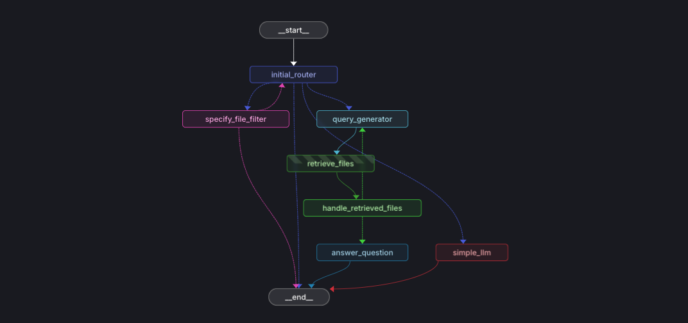

# Technical Documentation Agent 🔍📚

An intelligent agent system designed to answer questions about engine manuals and technical documentation. The agent uses a Retrieval Augmented Generation (RAG) approach to provide accurate, document-based responses.

## Table of Contents 📑

- [Architecture 🏗️](#architecture-️)
- [Agent Diagram 📊](#agent-diagram-)
- [Detailed Agent Architecture](#detailed-agent-architecture)
  - [State Graph as the Foundation](#state-graph-as-the-foundation)
  - [Agent State Structure](#agent-state-structure)
  - [Key Graph Nodes](#key-graph-nodes)
  - [Conditional Edges](#conditional-edges)
  - [Design Rationale](#design-rationale)
  - [Technical Summary](#technical-summary)
- [Installation 🛠️](#installation-️)
  - [Environment Variables](#environment-variables)
- [Usage 🚀](#usage-)
  - [Recommended: LangGraph Studio](#recommended-langgraph-studio)
  - [Programmatic Usage](#programmatic-usage)
- [Document Preprocessing Pipeline 📄](#document-preprocessing-pipeline-)
  - [Document Processing with Docling](#document-processing-with-docling)
  - [Production Considerations](#production-considerations)
  - [Implementation Notes](#implementation-notes)
- [Configuration ⚙️](#configuration-️)
- [Extending the Agent 🧩](#extending-the-agent-)
- [Code Structure 📁](#code-structure-)
- [Error Handling ⚠️](#error-handling-️)
- [Best Practices 💡](#best-practices-)
- [Citation Accuracy 📝](#citation-accuracy-)
- [Limitations and Future Improvements 🔮](#limitations-and-future-improvements-)
  - [Current Limitations](#current-limitations)
  - [Future Improvements](#future-improvements)

## Architecture 🏗️

This agent is built using a graph-based approach with the following components:

- **LangGraph**: Used for orchestrating the sequence of operations
- **LangChain**: Provides RAG components, LLM integration, and vector store connections
- **Qdrant**: Vector database for storing and retrieving document embeddings

The agent follows this workflow:
1. **Initial Routing**: Determine if the query requires document retrieval, file specification, or a simple response
2. **File Specification**: Identify which document to search based on the user's query
3. **Query Generation**: Reformulate the user's question into an effective search query
4. **Document Retrieval**: Find relevant document passages using vector search
5. **Response Generation**: Create a comprehensive answer based on retrieved information

## Agent Diagram 📊



## Detailed Agent Architecture

### State Graph as the Foundation

The agent uses a state graph architecture implemented with LangGraph, offering several key advantages:

1. **Modularity** - each graph node represents a separate functionality, making it easier to develop and test individual components
2. **Clear control flow** - the graph explicitly defines possible execution paths, increasing predictability and debuggability
3. **Flexibility** - workflows can be easily modified by adding or removing nodes and edges

### Agent State Structure

Central to the graph's operation is the `AgentState` class, which stores:

- **messages** - conversation history
- **initial_router_response** - initial router decision
- **final_router_response** - final router decision
- **current_file_filter** - active file filter
- **retrieved_files** - retrieved documents
- **number_of_requeries** - counter for repeated queries

### Key Graph Nodes

The agent consists of the following nodes:

1. **initial_router** - analyzes the user query and decides on the subsequent processing path
2. **specify_file_filter** - determines which documents the query relates to
3. **query_generator** - reformulates the user's question into an effective search query
4. **retrieve_files** - fetches relevant document fragments from the Qdrant database
5. **handle_retrieved_files** - evaluates the quality of retrieved documents and decides on next actions
6. **answer_question** - generates a response based on retrieved documents
7. **simple_llm** - generates a simple response without using documents

### Conditional Edges

Particularly important for the agent's flexibility are conditional edges that determine flow based on the current state:

1. **determine_step_after_initial_router** - decides whether file specification, query generation, or a simple response is needed
2. **determine_step_after_specify_file_filter** - decides whether to return to the router or end
3. **determine_step_after_handle_retrieved_files** - decides whether to answer the question or try to retrieve documents again

### Design Rationale

#### 1. RAG (Retrieval Augmented Generation) Approach

The agent uses the RAG approach, which allows:
- Generating responses based on specific documents
- Reducing model hallucinations by "anchoring" in facts
- Citing sources, increasing response credibility

#### 2. Multi-step Reasoning

By breaking down the process into sequential steps (document specification → query generation → retrieval → evaluation → response), the agent can:
- Make better decisions at each stage
- Iteratively improve its queries
- Handle complex cases requiring multi-step reasoning

#### 3. Safety Mechanisms

The agent includes several safety mechanisms:
- Limit on the number of repeated queries (maximum 4)
- Error handling for vector database connection
- Alternative paths in case of missing appropriate documents

#### 4. Flexible Context Adaptation

The ability to choose different paths allows the agent to:
- Answer simple questions without retrieving documents (resource efficiency)
- Adapt strategy to question complexity
- Refine document queries if the initial query is unclear

### Technical Summary

The agent architecture is a thoughtful compromise between:
- Implementation simplicity and functional complexity
- Flexibility and predictability of operation
- Autonomy and control over the response generation process

Using a state graph enables sequential processing of complex queries, with the ability to adapt the execution path based on intermediate results. This is particularly valuable in the context of handling technical documentation, where precision and credibility of responses are key.

## Installation 🛠️

```bash
# Create a virtual environment
python -m venv venv

# Activate the virtual environment
# On Windows:
venv\Scripts\activate
# On macOS/Linux:
source venv/bin/activate

# Install the agent's dependencies
pip install -r requirements.txt

# Set up required environment variables using the .env file
# An .env.example template is provided in the repository
cp .env.example .env
# Edit the .env file with your API keys and configuration
```

### Environment Variables

The following environment variables are required:
- `OPENAI_API_KEY`: Your OpenAI API key
- `QDRANT_API_KEY`: Your Qdrant API key
- `QDRANT_URL`: Your Qdrant instance URL
- `QDRANT_COLLECTION_NAME`: Name of your Qdrant collection

## Usage 🚀

### Recommended: LangGraph Studio

Simply open the project's root folder in LangGraph Studio to visualize and interact with the agent:

### Programmatic Usage

You can also use the agent programmatically:

```python
from agent.agent import agent
from langchain_core.messages import HumanMessage

# Create a user message
user_message = HumanMessage(content="What is the maintenance procedure for a Waukesha engine?")

# Run the agent
result = agent.invoke({"messages": [user_message]})

# Get the agent's response
response = result["messages"][-1].content
print(response)
```

## Document Preprocessing Pipeline 📄

The `pipelines` folder contains tools for preprocessing documents before they can be used by the agent:

### Document Processing with Docling

Due to the time constraints of this project, [Docling](https://github.com/docling/docling) was used for document processing. Docling simplifies document processing by:

- Parsing multiple document formats (PDF, DOCX, XLSX, HTML, images)
- Providing advanced PDF understanding (page layout, reading order, table structure)
- Supporting OCR for scanned documents
- Offering unified document representation

The preprocessing pipeline handles:
1. Document ingestion using Docling
2. Text extraction and cleaning
3. Chunking and metadata extraction
4. Vector embeddings generation
5. Storing in Qdrant for retrieval

You can examine how Docling processed the documents by checking the `data/processed` directory, which contains the extracted and processed content from the original files. This can be useful for debugging OCR quality, checking text extraction accuracy, and understanding the document structure as interpreted by the preprocessing pipeline.

### Production Considerations

For a production-ready application, additional verification mechanisms would be necessary:

- **OCR Quality Assurance**: Implement verification processes to ensure accuracy of OCR-extracted text, potentially using confidence scores and human review for critical documents
- **Query Generation Evaluation**: Measure and optimize the effectiveness of query reformulations by tracking semantic similarity between user questions and generated queries
- **Retrieval Effectiveness**: Implement metrics to evaluate retrieval performance such as recall@k and precision@k against human-labeled ground truth
- **Completeness Evaluation**: Add automated checks to verify that all relevant information from source documents is included in responses
- **Answer Quality Monitoring**: Implement systematic evaluation of final responses through sampling and human review or automated metrics comparing responses to source material

These verification mechanisms would ensure the reliability and accuracy of the entire pipeline, especially for critical technical documentation where precision is paramount.

### Implementation Notes

The current implementation of `specify_file_filter` relies on hardcoded file options which are used as filters for the Qdrant database queries. For a production-ready implementation, a better approach would be:

- Store summaries of each document during the preprocessing pipeline
- Create metadata filters based on document content and structure
- Implement a more dynamic file selection mechanism based on query context

This improvement would make the agent more scalable as new documents are added to the knowledge base.

## Configuration ⚙️

The agent can be configured by modifying the following:

- **File Options**: Update the `FILE_OPTIONS` in `agent/utils/nodes.py` to include your document set
- **Query Parameters**: Adjust retrieval parameters in the `retrieve_files` function
- **LLM Models**: Change the models used for different components in each node function

## Extending the Agent 🧩

To add more capabilities:
1. Define new node functions in `agent/utils/nodes.py`
2. Update the state model in `agent/utils/state.py` if needed
3. Modify the graph structure in `agent/agent.py` to incorporate new nodes

## Code Structure 📁

- `agent.py`: Graph definition and edge conditions
- `utils/nodes.py`: Implementation of all agent nodes
- `utils/state.py`: Definition of the agent's state model

## Error Handling ⚠️

The agent includes error handling for:
- Vector store connection failures
- Document retrieval errors
- Query processing issues

## Best Practices 💡

- Keep prompts updated with the latest document types
- Monitor the number of re-queries to optimize information retrieval
- Use environment variables for all sensitive configuration

## Citation Accuracy 📝

The agent provides document citations in its responses, but there are some important considerations regarding citation accuracy:

- **LLM Limitations**: Due to the nature of large language models, verbatim citation is not 100% guaranteed as models may paraphrase content even when instructed not to.

- **Document State Access**: For applications requiring absolute citation accuracy, the agent stores the complete retrieved documents in its state. Each document in `state.retrieved_files` contains the full content and comprehensive metadata.

- **Rich Metadata**: Each document contains metadata including:
  ```
  page_count: Total pages in the document
  pages: Specific page numbers for the citation
  headings: Section headings for better context
  filename: Original source filename
  mimetype: Document type
  _id: Unique identifier
  source: Path to the original document
  ```

- **Implementation Solution**: For critical applications requiring exact citation, the agent can be configured to return both the LLM-generated response and the exact document snippets with their metadata, allowing for verification or direct use of the source material.

This approach ensures that while the agent provides convenient natural language responses, the exact document text and reference information are always accessible when needed.

## Limitations and Future Improvements 🔮

While this agent provides a solid foundation for document-based question answering, there are several limitations and opportunities for improvement:

### Current Limitations

- **Hardcoded File Options**: The current system relies on predefined file options rather than dynamically discovering relevant documents.
- **Limited Context Window**: The agent may struggle with very large documents due to LLM context window limitations.
- **Single Query Language**: Currently optimized for English queries and documents.
- **Basic Error Recovery**: While the agent has error handling, it lacks sophisticated recovery mechanisms for certain edge cases.
- **Limited Multimedia Understanding**: Cannot process or reason about images, diagrams, or tables within documents.

### Future Improvements

- **Dynamic Document Discovery**: Implement a document indexing system that automatically categorizes and summarizes new documents.
- **Hierarchical Chunking**: Develop a more sophisticated chunking strategy that preserves document hierarchy and context.
- **Multi-modal Capabilities**: Extend to handle and reason about images, diagrams, and tables within technical documentation.
- **Active Learning**: Implement feedback loops to improve retrieval and answer quality based on user interactions.
- **Cross-document Reasoning**: Enhance the agent to synthesize information across multiple documents for complex queries.
- **Fine-tuned Embeddings**: Create domain-specific embedding models for better semantic search in technical documentation.
- **Conversation Memory**: Improve handling of follow-up questions with better conversation context retention.

By addressing these limitations, the agent could evolve into a more robust and versatile system for technical documentation assistance. 